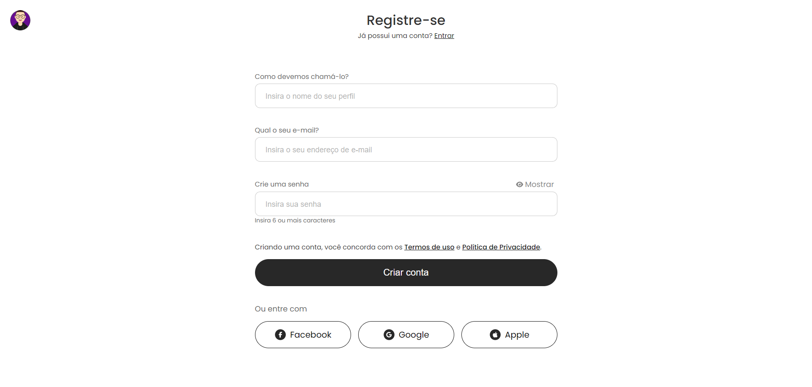

  <a href="#-tecnologias">Tecnologias</a>&nbsp;&nbsp;&nbsp;|&nbsp;&nbsp;&nbsp;
  <a href="#-projeto">Projeto</a>&nbsp;&nbsp;&nbsp;

 

  

## 🚀 Tecnologias

Esse projeto foi desenvolvido com as seguintes tecnologias:

- HTML
- CSS
- JavaScript

## 💻 Projeto

Uma página do estilo Sign Up feita com o objetivo de treinar e aprimorar habilidades inspirada em um dos designs do Figma "50+ Landing page designs": https://www.figma.com/community/file/1127302394641561751